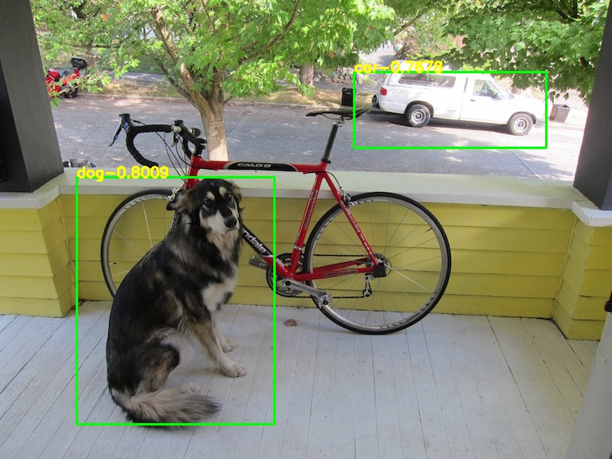

# YOLOV2_PyTorch
yolov2 to pytorch

## Demo
   

## 中文解读
传送门

## Model
[yolov2-tiny-voc.weights](https://pjreddie.com/media/files/yolov2-tiny-voc.weights)

## Reference
https://pjreddie.com/darknet/yolov2/
https://github.com/AlexeyAB/darknet
https://blog.csdn.net/samylee
